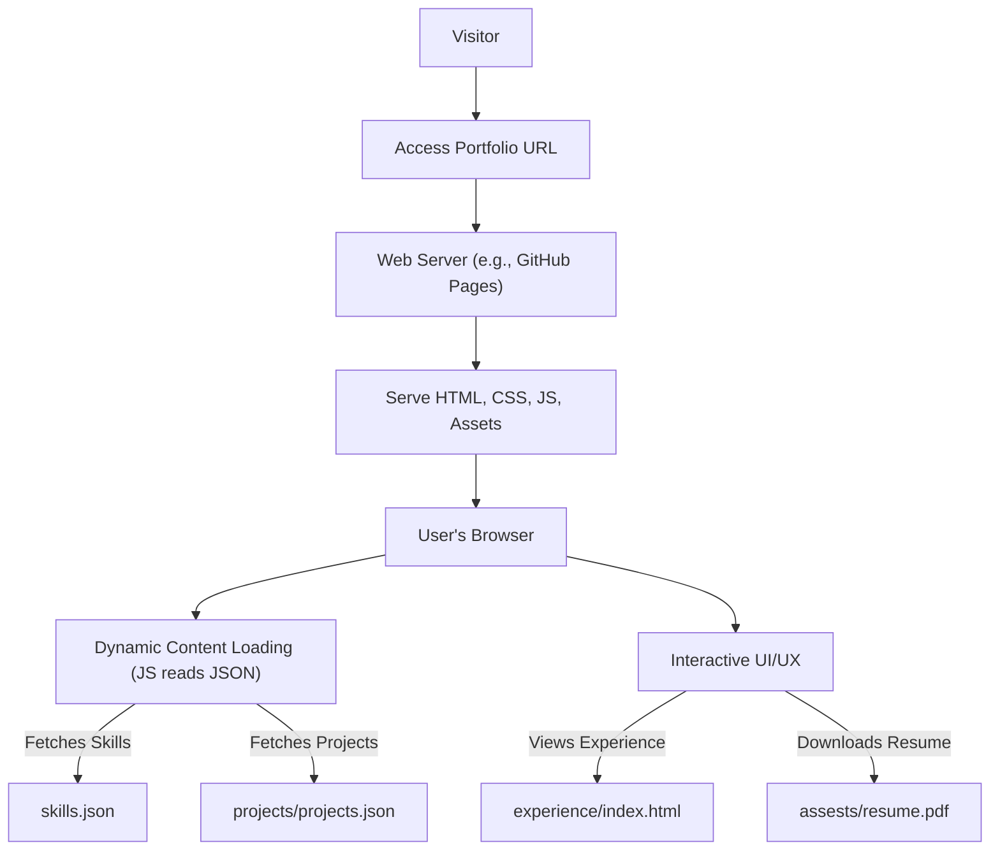

# 🚀 Dynamic Personal Portfolio Website

<p align="center"></p>

## Short Description
This repository hosts a cutting-edge, responsive, and fully dynamic personal portfolio website designed to captivatingly showcase a developer's skills, projects, and professional journey. Built with a focus on seamless user experience and modern design principles, it's the ultimate platform to impress recruiters, collaborate with peers, and highlight achievements.

## ✨ Key Features
*   **Interactive Skills Showcase:** Dynamically loads and displays skills from a dedicated JSON file, ensuring easy updates and a rich presentation.
*   **Comprehensive Project Portfolio:** Features a dedicated section for projects, populated from a `projects.json` file, allowing for easy management and expansion of your work showcase.
*   **Detailed Experience Timeline:** A beautifully crafted section to articulate professional and academic experiences, providing a clear narrative of your career growth.
*   **Responsive & Elegant Design:** Optimized for all devices, delivering a consistent and visually appealing experience whether on desktop, tablet, or mobile.
*   **Automated CI/CD Pipeline:** Leverages GitHub Actions for continuous integration and deployment, ensuring that your website is always up-to-date and deployed effortlessly with every commit.
*   **Custom 404 Page:** Enhances user experience with a personalized and engaging page for broken links or mistyped URLs.
*   **Direct Resume Download:** Offers a readily accessible PDF version of your resume for quick review by potential employers.
*   **Modern Web Technologies:** Built using a clean and efficient stack of HTML, CSS, and JavaScript, ensuring high performance and maintainability.

## Who is this for?
This project is ideal for:
*   **Job-seeking Developers:** Create a powerful first impression with a professional and interactive online presence.
*   **Freelancers & Consultants:** Effectively display your capabilities and past work to prospective clients.
*   **Students & Graduates:** Build a compelling digital resume to stand out in the competitive tech landscape.
*   **Anyone:** Looking for a solid foundation to build or enhance their personal brand in the digital realm.

## Technology Stack & Architecture
The project is architected as a robust static site, ensuring high performance, security, and low maintenance.

*   **Frontend:**
    *   **HTML5:** For structured content and semantic markup.
    *   **CSS3:** For modern styling, responsive layouts, and animations.
    *   **JavaScript:** For dynamic content loading, interactive elements, and enhanced user experience (including `particles.js` for visual flair).
*   **Data Management:**
    *   **JSON:** Used for managing dynamic content such as skills (`skills.json`) and projects (`projects/projects.json`), allowing for easy updates without touching core code.
*   **Build & Deployment:**
    *   **GitHub Actions:** Automates the CI/CD pipeline, handling testing and deployment of the static site to a web server (e.g., GitHub Pages, Netlify, Vercel).

## 📊 Architecture & Database Schema



## ⚡ Quick Start Guide
Get your personalized portfolio up and running in no time!

1.  **Clone the Repository:**
    ```bash
    git clone https://github.com/helper-one/portfolio_website.git
    cd portfolio_website
    ```
2.  **Explore Locally:**
    Open the `index.html` file directly in your web browser. For a more robust local development experience, you can use a simple local server:
    ```bash
    # If you have Python installed
    python -m http.server 8000
    # Then navigate to http://localhost:8000 in your browser
    ```
3.  **Customize Your Content:**
    *   Edit `skills.json` to update your technical proficiencies.
    *   Modify `projects/projects.json` to add or refine your project showcases.
    *   Update `assests/resume.pdf` with your latest resume.
    *   Personalize `index.html`, `experience/index.html`, and other HTML files with your personal details and narrative.
4.  **Deploy (Optional, using CI/CD):**
    If you host this project on GitHub, the `.github/workflows/ci-cd.yml` file is configured to automatically build and deploy your site (e.g., to GitHub Pages) upon pushes to the `main` branch. Simply commit your changes and push to activate the pipeline.

## 📜 License
This project is licensed under the [MIT License](LICENSE).