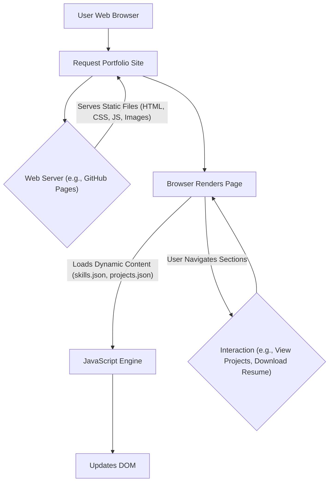

# 🚀 Dynamic Personal Portfolio Website

<p align="center"></p>

## Short Description
Unveiling a highly customizable, modern, and visually engaging personal portfolio website designed to elegantly showcase your skills, projects, and professional experience. This repository offers a robust foundation for developers and creatives alike to present their digital presence with flair and functionality. Built with a focus on seamless user experience and maintainability, it features a dynamic interface, a dedicated project showcase, and a professional summary of your journey.

## ✨ Key Features
*   **Dynamic & Responsive Design:** Crafted with modern HTML, CSS, and JavaScript, ensuring a stunning and adaptable experience across all devices.
*   **Comprehensive Project Showcase:** Easily highlight your accomplishments with a dedicated projects section, driven by `projects.json` for effortless updates.
*   **Interactive Skill Visualization:** Present your technical proficiencies in an engaging format, powered by `skills.json` for simple content management.
*   **Detailed Experience Timeline:** A dedicated page (`experience/index.html`) to outline your professional growth and milestones.
*   **Integrated Resume Download:** Provides a quick and accessible way for visitors to download your detailed CV (`assests/resume.pdf`).
*   **Automated CI/CD Pipeline:** Leverages GitHub Actions (`.github/workflows/ci-cd.yml`) for streamlined deployment and continuous integration, ensuring your site is always up-to-date.
*   **Interactive Backgrounds:** Enhanced user engagement with `particles.min.js` for captivating visual effects.
*   **Custom 404 Page:** A branded and user-friendly error page to guide visitors back on track.

## Who is this for?
This project is ideal for:
*   **Software Developers & Engineers:** Looking for a polished platform to display their coding projects and technical expertise.
*   **UI/UX Designers:** Seeking a creative canvas to exhibit their design portfolios and user-centric work.
*   **Freelancers & Consultants:** Needing a professional online presence to attract clients and showcase their services.
*   **Students & Job Seekers:** Aiming to make a strong first impression with a comprehensive and interactive resume website.

## Technology Stack & Architecture
This portfolio website is built on a robust and widely-adopted front-end stack, ensuring high performance and accessibility:

*   **Frontend:**
    *   **HTML5:** For structured content.
    *   **CSS3:** Styling with `assests/css/style.css` and dedicated styles for 404 and other sections.
    *   **JavaScript (ES6+):** Powering interactivity, dynamic content loading from `skills.json` and `projects/projects.json`, and animations.
*   **Libraries:**
    *   `particles.min.js`: For engaging background particle animations.
*   **Tooling & Deployment:**
    *   **GitHub Actions:** Implementing a Continuous Integration/Continuous Deployment (CI/CD) pipeline for automated testing and deployment.
    *   **VS Code:** Configuration for an optimized development environment (`.vscode/settings.json`).

## 📊 Architecture & Database Schema
Given this is a static website, there's no complex database schema. The architecture revolves around client-side rendering and data consumption from local JSON files.



## ⚡ Quick Start Guide
Get your personalized portfolio up and running in minutes!

1.  **Clone the Repository:**
    ```bash
    git clone https://github.com/helper-one/portfolio_website.git
    cd portfolio_website
    ```

2.  **Open in Browser:**
    Simply open the `index.html` file directly in your web browser.

3.  **Customize Your Content:**
    *   Edit `index.html` to update personal details and main sections.
    *   Modify `skills.json` to showcase your unique skill set.
    *   Update `projects/projects.json` to reflect your incredible projects.
    *   Replace `assests/resume.pdf` with your own resume.
    *   Personalize images in `assests/images/` as needed.

## 📜 License
This project is licensed under the MIT License. See the `LICENSE` file for more details.