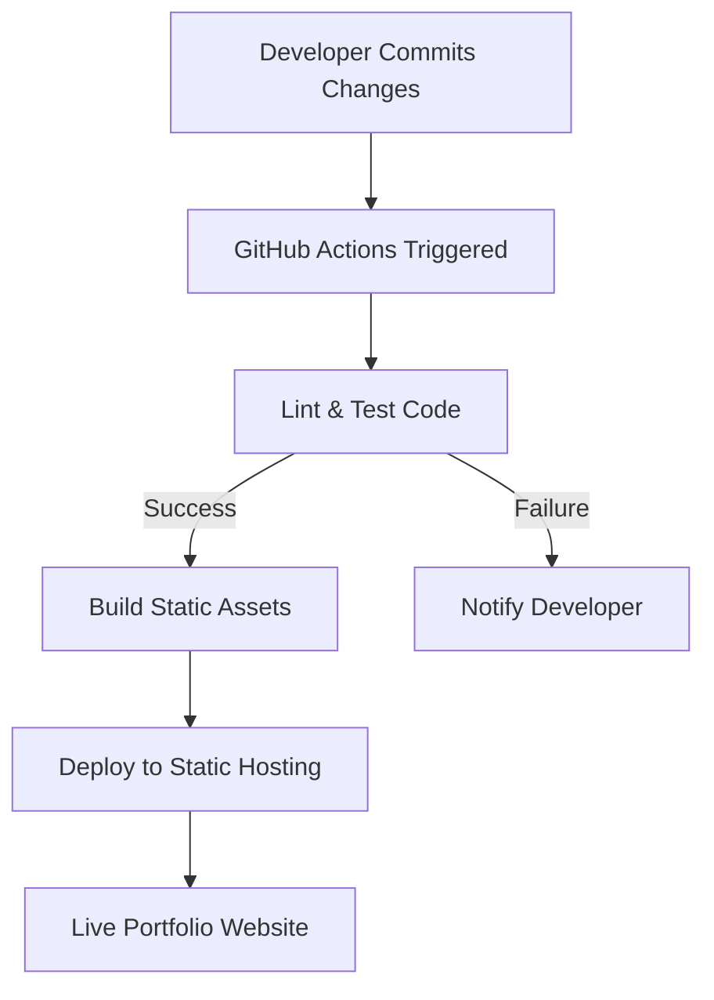

# 🚀 Dynamic Portfolio Website

<p align="center"></p>

## Short Description
Unleash your professional narrative with the **Dynamic Portfolio Website** – a sleek, highly customizable, and fully responsive web solution designed to showcase your skills, projects, and experience with unparalleled impact. Built for modern developers and creatives, this template transforms a static resume into an interactive and engaging online presence.

## ✨ Key Features
*   **Comprehensive Profile Display:** Dedicated sections for your skills, projects, and work experience.
*   **Dynamic Content Loading:** Leverage JSON files (`skills.json`, `projects/projects.json`) for easy content management and updates, allowing for rapid customization without diving into HTML.
*   **Integrated Resume:** A direct link to your professional `resume.pdf` for quick access by prospective employers or collaborators.
*   **Responsive & Modern Design:** Crafted with clean HTML, CSS, and JavaScript for a seamless experience across all devices.
*   **Automated Deployment (CI/CD):** Includes GitHub Actions workflow (`ci-cd.yml`) for continuous integration and deployment, ensuring your site is always up-to-date with minimal effort.
*   **Custom 404 Page:** A stylish and informative custom 404 page (`404.html`) to enhance user experience even on broken links.
*   **Engaging Visuals:** Features dynamic backgrounds (like `particles.min.js`) and high-quality image assets to captivate your audience.

## Who is this for?
This project is ideal for:
*   **Software Developers, Designers, and Freelancers:** Looking for a modern, personal website to present their portfolio.
*   **Job Seekers:** Who want to stand out with an interactive and professional online resume.
*   **Students & Graduates:** Aiming to create a strong first impression with a well-structured showcase of their academic and personal projects.
*   **Anyone** seeking an elegant, low-maintenance platform to highlight their professional achievements and expertise.

## Technology Stack & Architecture
This project is built as a highly performant **static website** utilizing core web technologies:
*   **Frontend:** HTML5, CSS3, JavaScript (Vanilla JS, `particles.min.js`)
*   **Content Management:** JSON for structured data (skills, projects)
*   **Deployment Automation:** GitHub Actions (for CI/CD)

## 📊 Architecture & Database Schema
Given this is a static portfolio website, it doesn't utilize a traditional database. Instead, its architecture focuses on efficient content delivery and automated deployment. Below is a simplified representation of the CI/CD pipeline that ensures continuous updates and availability.



## ⚡ Quick Start Guide
Get your personalized portfolio live in minutes!

1.  **Clone the repository:**
    ```bash
    git clone https://github.com/helper-one/portfolio_website.git
    cd portfolio_website
    ```
2.  **Customize your content:**
    *   Update `skills.json` with your expertise.
    *   Populate `projects/projects.json` with your showcase projects.
    *   Replace `assests/resume.pdf` with your own resume.
    *   Personalize `index.html` and other sections with your details and images (found in `assests/images`).
3.  **Local Preview:**
    Open `index.html` directly in your browser or use a simple local web server (`python -m http.server`).
4.  **Deploy:**
    Push your changes to your GitHub repository. The included `.github/workflows/ci-cd.yml` will automatically build and deploy your site to a configured static hosting service (e.g., GitHub Pages, Netlify, Vercel).

## 📜 License
This project is licensed under the terms of the `LICENSE` file.