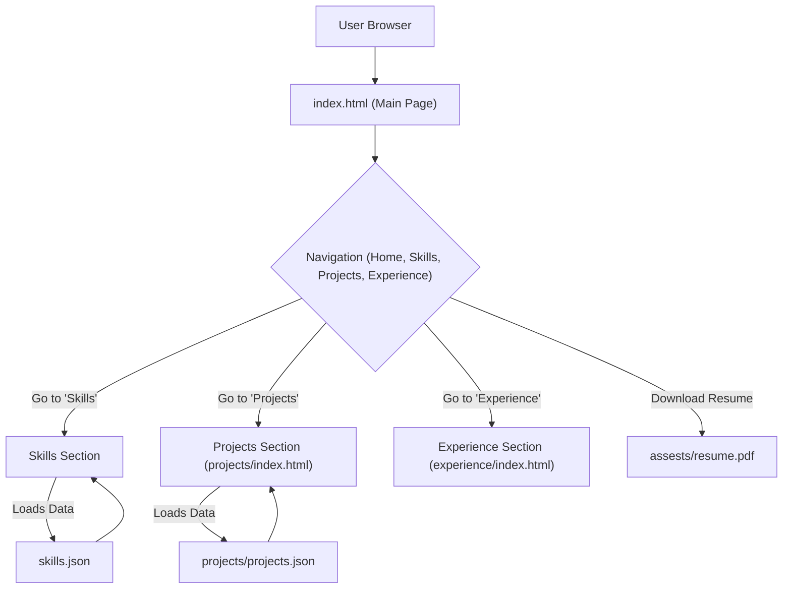

# 🚀 DynamicDev Portfolio

<p align="center"></p>

<p align="center">
  <a href="https://github.com/helper-one/portfolio_website/stargazers"></a>
  <a href="https://github.com/helper-one/portfolio_website/network/members"></a>
  <a href="https://github.com/helper-one/portfolio_website/issues"></a>
  <a href="./LICENSE"></a>
</p>

## Short Description

The **DynamicDev Portfolio** is a sleek, modern, and highly customizable personal portfolio website template designed to showcase your skills, projects, and professional journey with impact. Built with a focus on clean design, responsive layouts, and dynamic content loading, it provides an exceptional user experience while keeping your information organized and easily accessible. Perfect for developers, designers, and creatives looking to make a lasting impression!

## ✨ Key Features

*   **Responsive & Modern Design:** Crafted with contemporary web standards for seamless viewing across all devices.
*   **Dynamic Content Management:** Easily update your skills and projects via simple JSON files without touching a line of HTML.
*   **Dedicated Sections:** Clearly organized sections for your home, skills, projects, and professional experience.
*   **Integrated Resume Download:** Provide visitors with direct access to your professional resume (`assests/resume.pdf`).
*   **Interactive UI Elements:** Utilizes `particles.min.js` for an engaging visual experience.
*   **Custom 404 Page:** A branded and user-friendly error page (`404.html`) enhances professionalism.
*   **GitHub Actions CI/CD:** Ready for automated deployment and continuous integration with `.github/workflows/ci-cd.yml`.

## Who is this for?

This project is ideal for:

*   **Software Developers & Engineers:** Showcase your coding prowess and project contributions.
*   **Web Designers & UI/UX Specialists:** Highlight your design aesthetic and user-centric approach.
*   **Freelancers & Consultants:** Present your services and past work to potential clients.
*   **Students & Recent Graduates:** Create a compelling online presence for job applications and networking.
*   **Anyone** who needs a professional, modern, and easy-to-update platform to display their professional identity online.

## Technology Stack & Architecture

This portfolio is a robust static site, leveraging core web technologies for maximum performance and compatibility:

*   **Frontend:** HTML5, CSS3, JavaScript (Vanilla JS, `particles.min.js`).
*   **Content Management:** JSON files (`skills.json`, `projects/projects.json`) for dynamic data loading.
*   **Build/Deployment:** Configured for Continuous Integration/Continuous Deployment (CI/CD) using GitHub Actions.

## 📊 Architecture & Database Schema

The **DynamicDev Portfolio** employs a client-side architecture where content is primarily served as static assets and dynamically rendered using JavaScript. Content for projects and skills is fetched from local JSON files, eliminating the need for a complex backend database.



## ⚡ Quick Start Guide

To get your own **DynamicDev Portfolio** up and running, follow these simple steps:

1.  **Clone the repository:**
    ```bash
    git clone https://github.com/helper-one/portfolio_website.git
    cd portfolio_website
    ```
2.  **Open in your browser:**
    Simply open the `index.html` file in your preferred web browser to view the portfolio locally.
    ```bash
    # For macOS
    open index.html
    # For Windows
    start index.html
    # For Linux (using xdg-open or similar)
    xdg-open index.html
    ```
3.  **Customize your content:**
    *   Update `skills.json` and `projects/projects.json` with your personal information.
    *   Replace `assests/resume.pdf` with your own resume.
    *   Modify CSS in `assests/css/style.css` and JavaScript in `assests/js/app.js` and `assests/js/script.js` to personalize the look and feel.
4.  **Deploy:**
    This repository is set up for easy deployment via GitHub Pages. Push your changes to the `main` branch, and GitHub Actions (`.github/workflows/ci-cd.yml`) will handle the deployment for you!

## 📜 License

This project is licensed under the MIT License - see the [LICENSE](LICENSE) file for details.