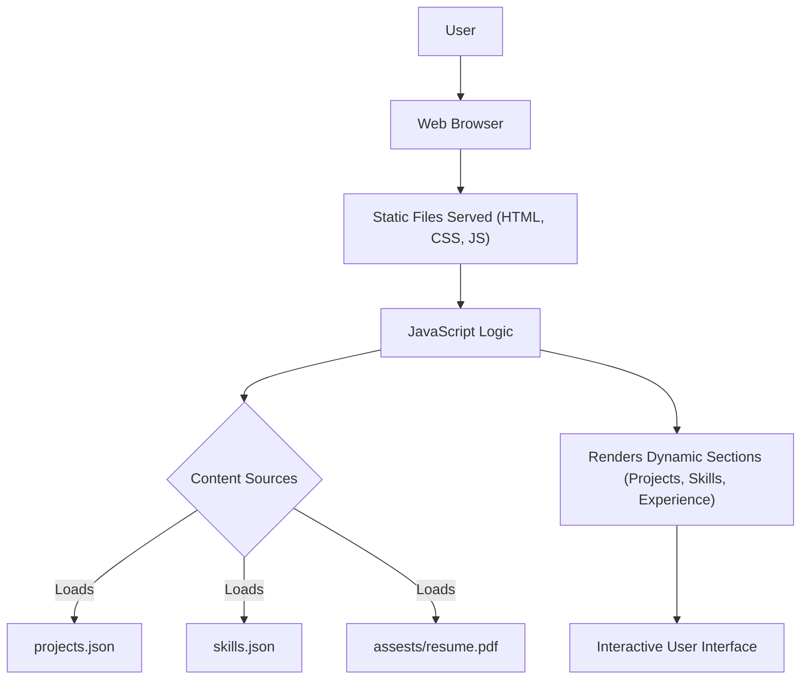

# 🚀 Personal Portfolio Website

<p align="center"></p>

## Short Description
Dive into a meticulously crafted, fully responsive personal portfolio website designed to showcase your skills, projects, and professional journey with unparalleled elegance and functionality. This dynamic platform is engineered to captivate recruiters and collaborators, providing a seamless and engaging user experience that highlights your unique expertise.

## ✨ Key Features
*   **Dynamic Content Management:** Easily update projects and skills via simple JSON files (`projects.json`, `skills.json`) without touching core HTML.
*   **Immersive User Experience:** Features interactive elements and smooth animations, including a particles background (`particles.min.js`), to provide a visually striking and engaging interface.
*   **Comprehensive Professional Showcase:** Dedicated sections for your `experience`, `projects`, and `skills`, offering a holistic view of your capabilities.
*   **Robust & Responsive Design:** Built with modern HTML, CSS, and JavaScript, ensuring a flawless experience across all devices and screen sizes.
*   **Automated Deployment (CI/CD):** Leverages GitHub Actions for streamlined continuous integration and deployment, guaranteeing a smooth and consistent update process.
*   **Custom 404 Page:** A beautifully designed custom error page enhances user retention and provides a consistent brand experience.
*   **Integrated Resume View:** Allows visitors to easily access and download your professional resume (`resume.pdf`).

## Who is this for?
This project is ideal for:
*   **Software Developers, Designers, and Creators** looking to present their work and experience in a professional, engaging, and easily maintainable online portfolio.
*   **Job Seekers** aiming to make a memorable impression on potential employers and showcase their technical prowess.
*   Anyone who wants a **static, high-performance website** to highlight their personal brand and achievements.

## Technology Stack & Architecture
This portfolio is built on a robust and widely-used client-side stack, ensuring accessibility, performance, and ease of deployment:
*   **Frontend:** HTML5, CSS3 (including custom styling via `style.css` and `404.css`), JavaScript (vanilla JS, `app.js`, `script.js`, and `particles.min.js` for visual effects).
*   **Data Management:** JSON files (`projects.json`, `skills.json`) for modular and easy-to-update content.
*   **Version Control:** Git
*   **Continuous Integration/Deployment:** GitHub Actions (`.github/workflows/ci-cd.yml`)

## 📊 Architecture & Database Schema
This project adopts a client-side architecture, serving static content and leveraging JSON files for data storage, eliminating the need for a traditional backend database.



## ⚡ Quick Start Guide
Get your personalized portfolio up and running in minutes!

1.  **Clone the repository:**
    ```bash
    git clone https://github.com/helper-one/portfolio_website.git
    cd portfolio_website
    ```
2.  **Open in your browser:**
    Simply open the `index.html` file in your preferred web browser:
    ```bash
    # On macOS
    open index.html
    # On Windows
    start index.html
    ```
    For a live server experience, you can use a simple static server (e.g., `npx http-server` or VS Code's Live Server extension).
3.  **Customize your content:**
    *   Edit `projects/projects.json` to showcase your latest work.
    *   Update `skills.json` to reflect your expertise.
    *   Replace `assests/resume.pdf` with your own resume.
    *   Modify `index.html`, `experience/index.html`, and `projects/index.html` as needed for personalization.

## 📜 License
This project is licensed under the MIT License. See the `LICENSE` file for more details.