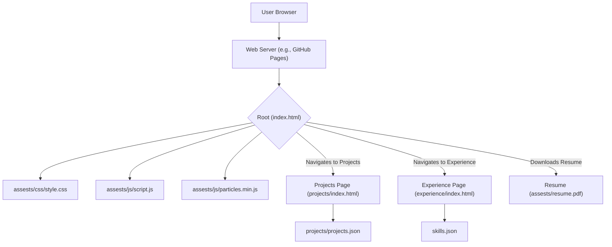

# 🚀 Dynamic Developer Portfolio

<p align="center"></p>

## Short Description

Unveiling a modern, responsive, and highly interactive personal portfolio website designed to brilliantly showcase a developer's skills, experience, and projects. This project transforms a static CV into a dynamic, engaging online presence, built with a keen eye for detail and a robust front-end architecture. It's not just a website; it's a statement of your technical prowess and creative vision.

## ✨ Key Features

*   **Striking User Interface:** A meticulously crafted, visually appealing design that ensures a memorable user experience.
*   **Comprehensive Project Showcase:** Dedicated sections to highlight your projects with detailed descriptions and visuals, sourced dynamically from `projects.json`.
*   **Professional Experience Timeline:** A clear, chronological presentation of your professional journey and achievements.
*   **Dynamic Skillset Display:** Categorized and interactive presentation of your technical skills, leveraging data from `skills.json`.
*   **Integrated Resume Download:** One-click access to your resume (`assests/resume.pdf`) for easy sharing with recruiters and collaborators.
*   **Seamless Responsiveness:** Optimized for a flawless viewing experience across all devices, from desktops to mobile phones.
*   **Interactive Elements:** Engaging animations and particle effects (`particles.min.js`) that bring the portfolio to life.
*   **Automated Deployment:** Configured with GitHub Actions (`.github/workflows/ci-cd.yml`) for continuous integration and delivery, ensuring smooth updates.
*   **Custom 404 Page:** A branded error page (`404.html`) to maintain user experience even on broken links.

## Who is this for?

This portfolio template is ideal for:

*   **Software Developers:** Professionals looking to present their work and experience in a modern, engaging format.
*   **Job Seekers:** Individuals aiming to stand out in a competitive market with a polished online presence.
*   **Freelancers:** Designers, developers, and consultants who need a compelling platform to showcase their expertise and attract clients.
*   **Students:** Aspiring tech professionals eager to display their academic projects and budding skills.

## Technology Stack & Architecture

This project is primarily a static site, leveraging core web technologies for maximum performance and broad compatibility.

*   **Frontend:** HTML5, CSS3, JavaScript (ES6+)
*   **Styling:** Pure CSS with custom styles (`assests/css/style.css`, `assests/css/404.css`) for a unique aesthetic.
*   **Interactivity:** Vanilla JavaScript, enhanced with `particles.min.js` for dynamic background effects.
*   **Content Management:** JSON files (`skills.json`, `projects/projects.json`) serve as simple, maintainable data sources for dynamic content sections.
*   **Version Control & Deployment:** Git and GitHub Actions for streamlined CI/CD, ensuring consistent and automated deployments.

## 📊 Architecture & Database Schema

As a static portfolio website, this project doesn't utilize a traditional database. Instead, it relies on client-side rendering with JSON data files to manage content. The architecture is straightforward and efficient, focusing on direct user interaction and content delivery.



## ⚡ Quick Start Guide

Get your own dynamic portfolio up and running in minutes!

1.  **Clone the repository:**
    ```bash
    git clone https://github.com/helper-one/portfolio_website.git
    cd portfolio_website
    ```
2.  **Open in Browser:** Simply open `index.html` in your favorite web browser to view the portfolio locally.
    ```bash
    open index.html # On macOS
    # or start a simple local server if needed, e.g., using Python:
    # python -m http.server
    ```
3.  **Customize Your Content:**
    *   Edit `skills.json` to update your technical proficiencies.
    *   Modify `projects/projects.json` to showcase your latest work.
    *   Update `assests/resume.pdf` with your current resume.
    *   Personalize `index.html`, `experience/index.html`, and `projects/index.html` as needed.
4.  **Deploy (Optional):** Push your changes to a GitHub repository, and leverage the included `.github/workflows/ci-cd.yml` for automated deployment to GitHub Pages or a similar static site hosting service.

## 📜 License

This project is licensed under the MIT License. See the `LICENSE` file for more details.