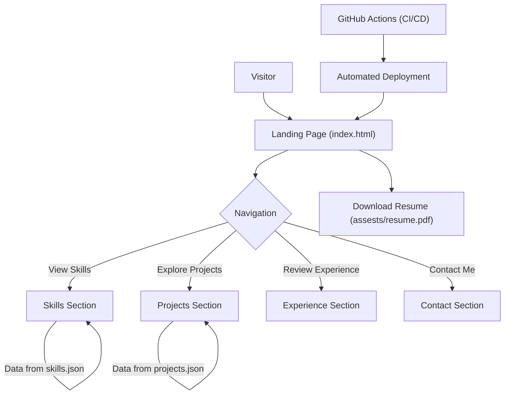

# 🚀 Portfolio Website

<p align="center"></p>

## Short Description

Unleash your professional identity with the **Portfolio Website** – a dynamic, responsive, and meticulously crafted platform designed to showcase your skills, projects, and professional journey to the world. Engineered for impact, this static site leverages modern web technologies and boasts an automated deployment pipeline, ensuring your personal brand is always polished and readily accessible.

## ✨ Key Features

*   **Striking Visual Presentation:** Captivate visitors with a clean, modern, and fully responsive design that looks impeccable on any device.
*   **Comprehensive Skill Showcase:** Clearly articulate your technical prowess with dedicated sections for all your proficiencies, powered by structured `skills.json` data.
*   **Dynamic Project Portfolio:** Present your projects with rich detail, images, and descriptions, leveraging `projects.json` for easy management and updates.
*   **Detailed Experience Timeline:** Chronical your professional journey, highlighting key roles, achievements, and contributions in an engaging format.
*   **Effortless Resume Access:** Provide visitors with a direct link to download your professional resume, ready for review.
*   **Robust CI/CD Pipeline:** Benefit from seamless, automated deployments via GitHub Actions, ensuring your site is always up-to-date and performant.
*   **Error-Resilient Navigation:** Custom 404 pages enhance user experience, gracefully handling missteps.

## Who is this for?

This project is ideal for **developers, designers, freelancers, and professionals** looking to establish a strong online presence. It's perfectly suited for:

*   **Job Seekers:** Impress recruiters and hiring managers with a professional, interactive resume.
*   **Freelancers:** Showcase your capabilities and past work to attract new clients.
*   **Students & Graduates:** Highlight academic projects and emerging skills to kickstart your career.
*   **Anyone:** Who wants a polished, easy-to-manage personal website to demonstrate their expertise.

## Technology Stack & Architecture

This Portfolio Website is a testament to robust frontend development and modern deployment practices, designed as a highly performant static site:

*   **Frontend Core:** HTML5, CSS3, and JavaScript for a rich, interactive user experience.
*   **Styling:** Custom CSS (`assests/css/style.css`, `experience/style.css`, `projects/style.css`, `assests/css/404.css`) for a unique aesthetic and responsive design.
*   **Interactivity:** JavaScript (`assests/js/app.js`, `assests/js/script.js`, `experience/script.js`, `projects/script.js`) powers dynamic content and smooth interactions.
*   **Data Management:** JSON files (`skills.json`, `projects/projects.json`) efficiently store and serve content for skills and project sections.
*   **Automated Deployment:** GitHub Actions (`.github/workflows/ci-cd.yml`) ensure continuous integration and continuous deployment, making updates effortless and consistent.

## 📊 Architecture & Database Schema

As a static portfolio website, there is no traditional backend database. The architecture focuses on content delivery and user experience, driven by local JSON data and static assets. The flow outlines how visitors navigate and interact with the site's content.



## ⚡ Quick Start Guide

Ready to get your professional portfolio up and running? Follow these simple steps:

1.  **Clone the Repository:**
    ```bash
    git clone https://github.com/helper-one/portfolio_website.git
    cd portfolio_website
    ```

2.  **Open Locally (Development):**
    Since this is a static site, you can directly open `index.html` in your browser. For a better development experience with a local server:
    ```bash
    # If you have Python installed
    python -m http.server 8000
    ```
    Then, open your browser and navigate to `http://localhost:8000`.

3.  **Customize Your Content:**
    *   Edit `index.html`, `experience/index.html`, `projects/index.html` to update text and structure.
    *   Modify `skills.json` and `projects/projects.json` with your specific skills and project details.
    *   Replace images in `assests/images/` with your own, ensuring paths are updated in HTML/CSS if necessary.
    *   Update `assests/resume.pdf` with your current resume.

4.  **Deploy (Production):**
    Push your changes to a GitHub repository. The `.github/workflows/ci-cd.yml` is configured for automated deployment, typically to GitHub Pages, which will automatically publish your site.

## 📜 License

This project is licensed under an open-source license. Please see the [LICENSE](LICENSE) file for more details.