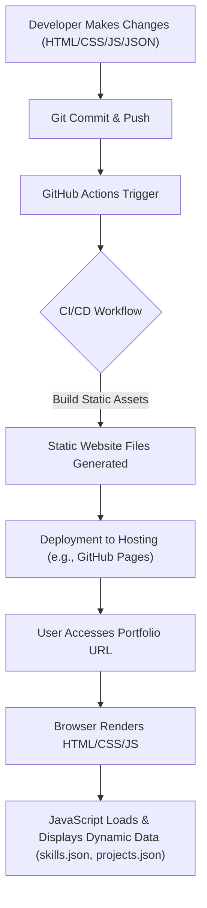

# 🚀 Dynamic Portfolio Website

<p align="center"></p>

## Short Description
Unleash your professional story with this dynamic, modern, and fully responsive portfolio website template! Designed for developers, designers, and creatives, this project provides an elegant and interactive platform to showcase your skills, projects, and professional journey. With an emphasis on clean code, effortless customization, and automated deployment, it's the perfect foundation to make a lasting impression online.

## ✨ Key Features
*   **Responsive & Modern Design:** Crafted with HTML, CSS, and JavaScript for a seamless experience across all devices.
*   **Dynamic Content Loading:** Easily manage your skills and projects via intuitive JSON files (`skills.json`, `projects/projects.json`), eliminating the need for constant code edits.
*   **Dedicated Sections:** Comprehensive pages for your Home, Projects, and Experience, each meticulously designed for clarity and impact.
*   **Automated CI/CD Pipeline:** Leverage GitHub Actions for streamlined, continuous integration and deployment, ensuring your portfolio is always up-to-date with minimal effort.
*   **Custom 404 Page:** A branded and user-friendly 404 error page to maintain a professional appearance even when navigation goes awry.
*   **Interactive UI Elements:** Engaging JavaScript interactions, including `particles.min.js`, to create a visually captivating user experience.
*   **Integrated Resume:** Quick access to your professional resume (e.g., `assests/resume.pdf`) for potential employers or collaborators.

## Who is this for?
This project is ideal for:
*   **Software Developers & Engineers:** Showcase your coding prowess, personal projects, and technical skills.
*   **UI/UX Designers:** Present your design portfolio in an aesthetically pleasing and functional manner.
*   **Freelancers & Consultants:** Establish a strong online presence to attract new clients.
*   **Students & Recent Graduates:** Create a compelling digital resume to kickstart your career.
*   Anyone seeking a clean, customizable, and high-performance platform to highlight their professional achievements.

## Technology Stack & Architecture
This project is a testament to robust, modern web development practices built on a lean, efficient stack:

*   **Frontend:** HTML5, CSS3, JavaScript (Vanilla JS & `particles.min.js` for interactive backgrounds).
*   **Content Management:** Flat-file JSON for dynamic project and skill data.
*   **Version Control:** Git
*   **Continuous Integration/Deployment (CI/CD):** GitHub Actions (`.github/workflows/ci-cd.yml`)

## 📊 Architecture & Database Schema
This portfolio operates as a static site, meaning its content is pre-rendered and served directly to the user. Dynamic elements like skills and projects are loaded client-side from local JSON files, eliminating the need for a traditional backend database. The architecture focuses on rapid delivery and maintainability via an automated deployment pipeline.



## ⚡ Quick Start Guide
Get your portfolio up and running in minutes!

1.  **Clone the Repository:**
    ```bash
    git clone https://github.com/helper-one/portfolio_website.git
    cd portfolio_website
    ```
2.  **Customize Content:**
    *   Edit `index.html`, `experience/index.html`, `projects/index.html` to update static content.
    *   Modify `skills.json` to reflect your unique skill set.
    *   Update `projects/projects.json` with details of your impressive projects.
    *   Replace images in `assests/images` with your own (e.g., `profile.jpg`, project screenshots).
    *   Update `assests/resume.pdf` with your latest resume.
3.  **Local Development (Optional):**
    You can open `index.html` directly in your browser, or for a better experience, serve it with a simple local HTTP server (e.g., `python -m http.server` or `npx serve`).
4.  **Deployment:**
    This project is configured for seamless deployment via GitHub Actions. Push your changes to the `main` branch, and the CI/CD pipeline (`.github/workflows/ci-cd.yml`) will automatically build and deploy your updated portfolio.

## 📜 License
This project is licensed under the [MIT License](LICENSE).