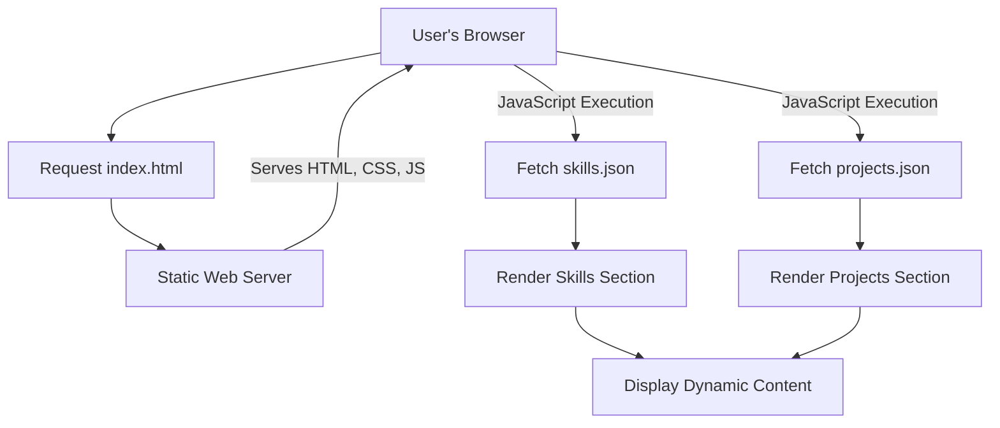

# 🚀 Dynamic Portfolio Website

<p align="center"></p>

## Short Description
Unleash your professional narrative with the **Dynamic Portfolio Website**! This repository hosts a sleek, responsive, and highly customizable personal portfolio designed to showcase your skills, projects, and professional journey with captivating elegance. Engineered for clarity and impact, it offers a seamless way to present your work and connect with potential employers or collaborators.

## ✨ Key Features
*   **Interactive Project Showcase:** Dynamically loads and displays your projects from `projects.json`, making it effortless to update your portfolio.
*   **Comprehensive Skills Section:** Highlights your technical proficiencies, powered by data from `skills.json` for easy management.
*   **Detailed Experience Timeline:** A dedicated section to articulate your professional journey and achievements.
*   **Responsive & Modern UI:** Crafted with HTML, CSS, and JavaScript, ensuring a stunning and adaptable experience across all devices.
*   **Interactive Backgrounds:** Utilizes `particles.min.js` for an engaging and modern visual appeal.
*   **Integrated CI/CD Workflow:** Automates deployment and testing via GitHub Actions (`ci-cd.yml`) for robust and continuous delivery.
*   **Downloadable Resume:** Provides a direct link to your professional resume (`resume.pdf`), making it convenient for visitors to learn more about your background.
*   **SEO-Friendly Structure:** Optimized for discoverability and a strong online presence.

## Who is this for?
This project is ideal for:
*   **Software Developers & Engineers:** To present their coding projects, skills, and experience.
*   **Designers & Creatives:** To showcase their visual work and design capabilities.
*   **Students & Graduates:** To create a professional online presence for job applications and academic portfolios.
*   **Freelancers & Consultants:** To attract new clients by demonstrating expertise and past work.
*   Anyone looking for a **personal branding platform** to highlight their professional achievements.

## Technology Stack & Architecture
This portfolio is built on a robust and widely-adopted frontend stack, ensuring high performance and maintainability:

*   **Frontend:** HTML5, CSS3, JavaScript (Vanilla JS, `particles.js`)
*   **Styling:** Custom CSS, organized for readability and reusability.
*   **Data Management:** JSON files (`skills.json`, `projects.json`) for dynamic content loading, making updates simple and efficient.
*   **Asset Management:** Organized `assests` directory for images, stylesheets, and scripts.
*   **Continuous Integration/Continuous Deployment (CI/CD):** Leverages GitHub Actions for automated build and deployment processes.

## 📊 Architecture & Database Schema
This portfolio operates as a static site, where content is primarily served directly to the browser. Dynamic sections like "Skills" and "Projects" are populated client-side using JavaScript from local JSON data files.



## ⚡ Quick Start Guide
To get your own version of this portfolio up and running locally, follow these simple steps:

1.  **Clone the Repository:**
    ```bash
    git clone https://github.com/helper-one/portfolio_website.git
    cd portfolio_website
    ```

2.  **Open in Browser:**
    Simply open the `index.html` file in your preferred web browser. You can also use a local server for better development experience (e.g., VS Code Live Server extension).

3.  **Customize Your Content:**
    *   Edit `index.html` for main content and structure.
    *   Update `assests/css/style.css` and other CSS files for styling.
    *   Modify `assests/js/app.js` and `assests/js/script.js` for custom JavaScript logic.
    *   Populate `skills.json` and `projects/projects.json` with your personal data.
    *   Replace `assests/resume.pdf` with your own resume.
    *   Swap images in `assests/images` with your personal branding elements.

## 📜 License
This project is licensed under the terms of the `LICENSE` file.