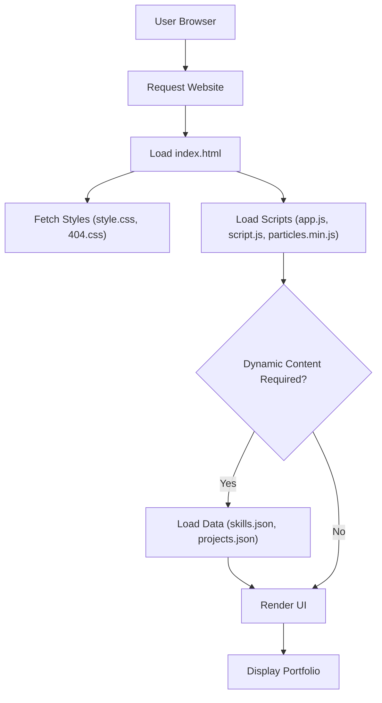

# 🚀 Portfolio Website

<p align="center"></p>

## Short Description

Unleash your professional presence with the **Portfolio Website** – a sleek, dynamic, and fully responsive platform designed to brilliantly showcase your expertise, projects, and professional journey. Crafted with modern web technologies, this repository provides a robust, easy-to-customize foundation to tell your unique story to recruiters, clients, and collaborators alike.

## ✨ Key Features

*   **Dynamic Content Management:** Easily update your skills and projects via intuitive JSON files, eliminating the need for complex database interactions.
*   **Dedicated Sections:** Comprehensive `Home`, `Experience`, and `Projects` sections ensure a structured and engaging user experience.
*   **Immersive Visuals:** Engaging animated backgrounds powered by `particles.js` and a rich collection of assets create a memorable first impression.
*   **Professional Resume Integration:** Direct link to your resume (`assests/resume.pdf`) for convenient access by potential employers.
*   **Custom 404 Page:** A thoughtfully designed custom 404 page enhances user experience even when navigating off-path.
*   **Automated CI/CD:** Streamlined deployment process using GitHub Actions, ensuring your latest updates are always live with minimal effort.
*   **Clean & Modular Codebase:** Built with maintainability in mind, featuring well-organized HTML, CSS, and JavaScript.

## Who is this for?

This project is ideal for:

*   **Software Developers & Engineers:** Present your technical skills and project accomplishments in a compelling format.
*   **Designers & Creatives:** Showcase your visual work and design thinking.
*   **Job Seekers:** A critical tool to impress hiring managers and stand out in the competitive job market.
*   **Freelancers & Consultants:** Establish credibility and attract new clients by demonstrating your capabilities.
*   **Anyone needing a personal web presence:** A fast and effective way to build a professional online portfolio.

## Technology Stack & Architecture

This portfolio website is built using a modern, efficient, and widely understood web stack:

*   **Frontend:**
    *   **HTML5:** For semantic content structure.
    *   **CSS3:** Styling, including a custom stylesheet (`style.css`) and specific styling for 404 pages.
    *   **JavaScript (Vanilla JS):** Core interactivity and dynamic content loading from JSON.
    *   **Particles.js:** For captivating interactive background animations.
*   **Content Management:**
    *   **JSON:** `skills.json` and `projects/projects.json` for dynamic data display.
*   **Development Tools:**
    *   **VS Code:** Project configuration (`.vscode/settings.json`).
*   **Deployment:**
    *   **GitHub Actions:** For Continuous Integration and Continuous Deployment (CI/CD) workflows (`.github/workflows/ci-cd.yml`).

## 📊 Architecture & Database Schema

As a static portfolio website, there's no traditional backend database. The architecture is client-side driven, with data loaded from local JSON files.



## ⚡ Quick Start Guide

Getting your personalized portfolio up and running is straightforward:

1.  **Clone the Repository:**
    ```bash
    git clone https://github.com/helper-one/portfolio_website.git
    cd portfolio_website
    ```
2.  **Open in Browser:**
    Simply open the `index.html` file in your preferred web browser:
    ```bash
    # On macOS/Linux
    open index.html
    # On Windows
    start index.html
    ```
3.  **Customize Your Content:**
    *   Edit `index.html` for main page structure and text.
    *   Update your skills in `skills.json`.
    *   Add or modify your projects in `projects/projects.json`.
    *   Personalize styling in `assests/css/style.css`.
    *   Replace `assests/resume.pdf` with your actual resume.

## 📜 License

This project is licensed under the MIT License. See the `LICENSE` file for full details.