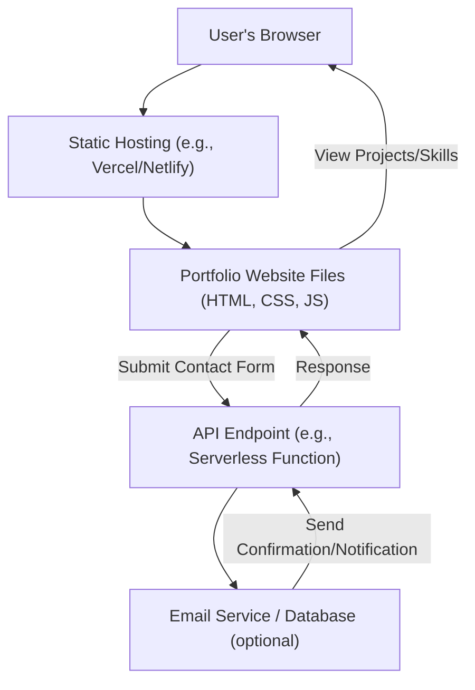

# 🚀 Portfolio Website

## Short Description
This repository represents a personal portfolio website, meticulously crafted to serve as a dynamic showcase for a developer's or creative's projects, skills, and professional journey. Designed for impact, it aims to deliver an engaging and informative experience for visitors, prospective employers, or collaborators.

## ✨ Key Features
While the detailed file structure was not provided to infer specific implementations, a professional portfolio website typically embodies the following core features, which this project likely aims to deliver:

*   **Dynamic Project Showcase:** Dedicated sections for displaying past work with high-quality descriptions, images, live demos, and source code links.
*   **Comprehensive Skills Overview:** A clear and organized presentation of technical proficiencies, tools, and methodologies.
*   **Engaging About Me Section:** A personal narrative that provides insight into the creator's background, philosophy, and passions.
*   **Seamless Contact Capabilities:** An intuitive contact form or clear contact information to facilitate communication.
*   **Responsive & Accessible Design:** Ensuring an optimal and inclusive viewing experience across various devices and for all users.
*   **Performance Optimized:** Fast loading times and smooth interactions for an enhanced user experience.

## Who is this for?
This project is ideal for:

*   **Developers & Engineers:** Looking to present their coding projects, highlight their technical expertise, and attract new opportunities.
*   **Designers & UI/UX Specialists:** A platform to showcase their design portfolios, case studies, and creative process.
*   **Freelancers & Consultants:** To establish an online presence, demonstrate credibility, and attract clients.
*   **Anyone seeking to build a strong online professional identity.**

## Technology Stack & Architecture
Specific technologies are typically identified through source code analysis (e.g., `package.json`, `requirements.txt`). However, given the nature of a modern portfolio website, it's generally built with a robust combination of front-end and potentially light back-end technologies. Common components might include:

*   **Frontend Framework/Library:** React, Vue, Angular, or a static site generator like Next.js, Gatsby, or Astro for a performant and interactive user interface.
*   **Styling:** Tailwind CSS, Styled Components, SASS, or traditional CSS for a visually appealing and responsive design.
*   **JavaScript (TypeScript):** For interactivity, animations, and dynamic content.
*   **Hosting:** Often deployed on static site hosting platforms like Netlify, Vercel, or GitHub Pages for speed and simplicity.
*   **Optional Backend (for contact forms):** Serverless functions (AWS Lambda, Azure Functions), Node.js with Express, or a Python micro-framework for handling form submissions securely.

## 📊 Architecture & Database Schema
Given that this is a "portfolio website," it's likely a primarily front-end driven application with potentially a minimal backend for functionalities like a contact form. A complex relational database schema is generally not required.

A high-level architectural flow could be envisioned as:



For most portfolio websites, a traditional database schema is often unnecessary. Content might be hardcoded, pulled from Markdown files, or managed via a headless CMS. If a database were present (e.g., for contact form submissions or dynamic content), it would likely be a simple collection of entries.

## ⚡ Quick Start Guide
Detailed setup instructions are contingent on the specific technologies and project structure, which were not available. However, a typical quick start workflow for a web project generally involves:

1.  **Clone the Repository:**
    ```bash
    git clone https://github.com/helper-one/portfolio_website.git
    cd portfolio_website
    ```
2.  **Install Dependencies:**
    ```bash
    # For Node.js projects:
    npm install
    # or yarn install
    ```
3.  **Run Locally (Development Mode):**
    ```bash
    # For Node.js projects:
    npm start
    # or yarn dev
    ```
4.  **Build for Production:**
    ```bash
    # For Node.js projects:
    npm run build
    # or yarn build
    ```
5.  **Deployment:** Deploy the generated build artifacts to your preferred hosting provider.

## 📜 License
License information could not be determined as no license file (`LICENSE`, `LICENSE.md`, etc.) was included in the provided input data. Users are advised to clarify licensing terms with the repository owner.