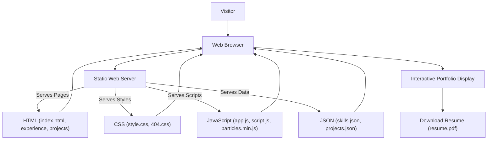

# 🚀 Personal Portfolio Website

<p align="center"></p>

## Short Description

Elevate your online presence with this robust, modern, and highly customizable personal portfolio website. Designed to professionally showcase your skills, projects, and experience, this platform provides a dynamic and engaging experience for visitors. Built with a focus on performance and seamless navigation, it's the perfect digital canvas to highlight your professional journey and connect with opportunities.

## ✨ Key Features

*   **Dynamic Project Showcase:** Seamlessly display your projects, fetching details from a structured JSON file for easy updates without touching HTML.
*   **Interactive Skills Section:** Highlight your technical proficiencies with a dedicated, organized skills section powered by JSON data.
*   **Comprehensive Experience Timeline:** Present your professional journey in a clear and engaging format.
*   **Optimized Performance:** Crafted with clean HTML, efficient CSS, and performant JavaScript for a fast and smooth user experience.
*   **Responsive Design:** Flawlessly adapts to any device, ensuring your portfolio looks stunning on desktops, tablets, and mobile phones.
*   **Integrated CI/CD Workflow:** Automated deployment ensures your latest updates are always live and accessible.
*   **Custom 404 Page:** Provides a branded experience even when visitors land on a broken link.
*   **Downloadable Resume:** Offer visitors a direct link to download your detailed professional resume.
*   **Elegant & Modern UI:** A visually appealing design that makes a strong first impression.

## Who is this for?

This project is ideal for:
*   **Software Developers:** Showcase your coding prowess and project portfolio.
*   **Designers:** Present your creative works in an organized, stylish manner.
*   **Freelancers:** Attract new clients by demonstrating your capabilities and past successes.
*   **Job Seekers:** Provide potential employers with a comprehensive overview of your skills and experience.
*   **Anyone** looking for a professional, easily manageable online presence to highlight their professional accomplishments.

## Technology Stack & Architecture

This portfolio website is a testament to the power of modern web development using foundational technologies:

*   **Frontend:**
    *   **HTML5:** For structured and semantic content.
    *   **CSS3:** For captivating and responsive styling, including custom 404 page styles.
    *   **JavaScript (ES6+):** For dynamic content loading, interactive elements, and overall site functionality, utilizing `particles.min.js` for engaging background effects.
*   **Data Management:**
    *   **JSON:** Used for managing projects (`projects/projects.json`) and skills (`skills.json`), allowing for easy updates and content scalability.
*   **Deployment & Automation:**
    *   **GitHub Actions:** Implementing CI/CD pipelines for automated testing and deployment, ensuring continuous integration and delivery of updates.

## 📊 Architecture & Database Schema

As a static website, this project leverages a straightforward, client-side architecture focused on delivering a rich user experience directly through the browser.



## ⚡ Quick Start Guide

Getting your portfolio up and running is incredibly simple:

1.  **Clone the repository:**
    ```bash
    git clone https://github.com/helper-one/portfolio_website.git
    cd portfolio_website
    ```
2.  **Open in your browser:**
    Simply open the `index.html` file in your preferred web browser. For local development, it's recommended to serve the files using a simple HTTP server (e.g., `python -m http.server` or `npx serve`).

3.  **Customize your content:**
    *   Update `skills.json` and `projects/projects.json` with your own data.
    *   Replace images in `assests/images` with your visuals.
    *   Update `assests/resume.pdf` with your latest resume.
    *   Modify HTML and CSS files to tailor the design to your brand.

4.  **Deploy:**
    Leverage the integrated GitHub Actions workflow for seamless deployment to your static hosting provider (e.g., GitHub Pages, Netlify, Vercel).

## 📜 License

This project is licensed under the MIT License. See the [LICENSE](LICENSE) file for details.